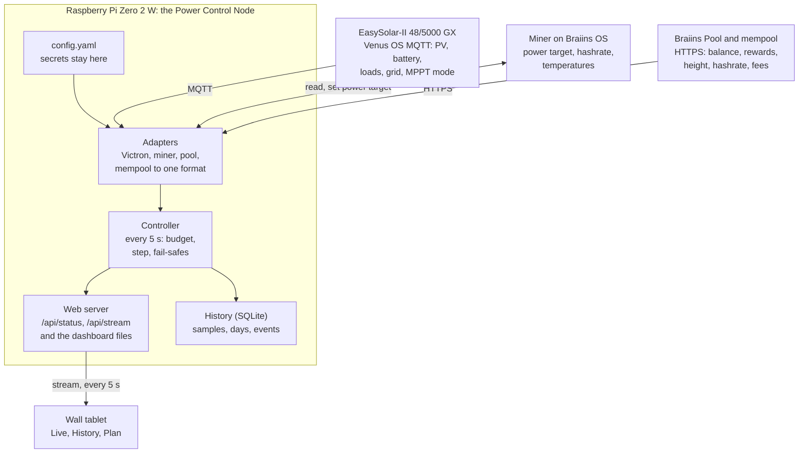
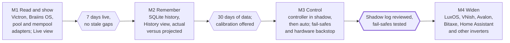

# SolarSats v2: local bridge, dashboard and curtailment

29 September 2026 · Carl

## Purpose and scope

v2 turns SolarSats into a local monitor and controller: one Raspberry Pi Zero 2 W reads the Victron system and the miner, runs the curtailment logic, keeps history, and serves the dashboard to a tablet on the wall. The v1 calculator stays locked and becomes the Plan view of the same app.

The repo ships one codebase in two modes:

- **Public calculator** on GitHub Pages: v1 plus live network figures from a mempool API, no setup, no personal data.
- **Local dashboard** on the Pi: the same frontend plus a Live view fed by the bridge, configured by editing one file.

Design principles:

- **Sats only.** Every figure the dashboard shows as value is in sats; energy is in W and kWh.
- **Everything on one box.** Bridge, controller, history and web server run on the Pi; nothing leaves the LAN except calls to the pool and mempool APIs.
- **Control lives on the Pi, not the page.** The controller keeps running when the tablet sleeps; the dashboard displays what it is doing and why.
- **Adapters behind one data format.** The frontend never knows it is talking to Victron or Braiins, so other inverters and miners are added without touching it.
- **Fail safe, not fail hashing.** Lost data or lost contact always ends with the miner at minimum power or paused, never at full power.
- **Surplus first.** The house and the battery are served before the miner; the miner only takes what would otherwise be wasted or exported.

## System overview

One Pi Zero 2 W does all the work: it reads the Victron system and the miner, runs the controller, keeps the history and serves the dashboard.



The tablet only displays; if it sleeps or drops off the network, control carries on unchanged.

## Hardware and site assumptions

The reference build is an EasySolar-II 48/5000 GX with a Braiins OS–capable Antminer, a Pi Zero 2 W and a wall tablet, all on one LAN. Figures below are nominal; check each unit's datasheet.

| Part | Reference choice | What matters to v2 |
| --- | --- | --- |
| Inverter/charger | Victron EasySolar-II 48/5000 GX: MultiPlus-II 48/5000 + SmartSolar MPPT 250/100 + built-in GX | One Venus OS data source for PV, battery, loads and grid; about 4 kW continuous AC out at 25 °C, less when hot |
| PV charger | Built-in MPPT 250/100 | 100 A charge limit caps harvest near 5.8 kW at 58 V; a 6 kWp array will clip at peak |
| Array and battery | About 6 kWp, about 5 kWh, 48 V | Small battery: the controller must protect it and not treat it as surplus |
| Miner | Not yet chosen: S19k Pro, S21-series, or a trial of 2× S19 Pro 96TH | Power target range, how fast it curtails, and wall draw against the inverter limit |
| Miner firmware | Braiins OS as default; LuxOS, VNish and stock also readable | LuxOS curtails in under 5 s, Braiins OS and VNish in about 30 s; this sets the control loop's pace |
| Bridge | Raspberry Pi Zero 2 W, 64-bit Raspberry Pi OS Lite | 512 MB RAM, 2.4 GHz Wi-Fi only; a USB Ethernet adapter is worth it for reliability |
| Display | Any tablet with a modern browser | Kiosk mode and screen wake lock; no app to install |

Two limits shape the controller:

- **Inverter headroom.** The miner and the house share about 4 kW of AC output. An S21 at 3.5 kW leaves only about 500 W for the house, so the controller caps miner power at inverter limit minus live house load minus a margin.
- **Battery size.** At about 5 kWh, the battery can cover a miner for an hour or two at most. The controller must never let the miner drain it; the battery is for the house.

The Pi is the Power Control Node: deterministic sense, decide, actuate and report, with fixed rules and no AI in the loop.

## Data sources and adapters

Four sources feed the bridge, each through its own adapter; only the miner adapter also writes.

| Source | Adapter talks via | Reads | Writes | Poll |
| --- | --- | --- | --- | --- |
| Victron GX (Venus OS) | MQTT on the GX, port 1883, subscribe and keep-alive | PV power and yield, MPPT mode, battery SoC and power, AC loads, grid, inverter state | Nothing in v2 | Push, sub-second |
| Miner | pyasic (Braiins OS, LuxOS, VNish, stock Antminer); HTTP for Bitaxe | Hashrate, wall power, power target, chip and board temps, fans, state | Power target, pause, resume | 5 s |
| Braiins Pool | HTTPS API with the user's access token | Balance, today's and yesterday's rewards, worker hashrate and state | Nothing | 5 min |
| Mempool | HTTPS API, own node or mempool.space | Tip height, network hashrate, fees per block, recent block time | Nothing | 10 min |

### Victron: Venus OS MQTT

MQTT is switched on in the GX settings; the menu name differs between Venus OS versions. The adapter finds the portal ID by subscribing to `N/+/system/0/Serial`, then must publish to `R/<portal id>/keepalive` about every 30 s, or recent Venus OS versions stop sending. Values arrive as JSON with a `value` field.

| Value | Topic after `N/<portal id>/` | Unit |
| --- | --- | --- |
| PV power, all chargers | `system/0/Dc/Pv/Power` | W |
| PV yield today | `solarcharger/<inst>/History/Daily/0/Yield` | kWh |
| MPPT operation mode | `solarcharger/<inst>/MppOperationMode` | 0 off, 1 limited, 2 tracking |
| Charger state | `solarcharger/<inst>/State` | bulk, absorption, float |
| Battery state of charge | `system/0/Dc/Battery/Soc` | % |
| Battery power | `system/0/Dc/Battery/Power` | W, positive = charging |
| AC loads, miner included | `system/0/Ac/Consumption/L1/Power` | W |
| Grid | `system/0/Ac/Grid/L1/Power` | W, positive = import |
| Inverter state and output | `vebus/<inst>/State`, `vebus/<inst>/Ac/Out/L1/P` | code, W |

The MPPT operation mode matters most: when it reads *limited*, the panels could give more than is being drawn, which is the signal the off-grid controller uses to probe for hidden surplus. Paths are to be checked against the Venus OS D-Bus documentation for the installed firmware.

### Miner

Each miner adapter declares its capabilities so the controller knows how to drive it:

| Control type | Examples | How the controller uses it |
| --- | --- | --- |
| Continuous | Braiins OS, LuxOS, VNish | Sets a power target anywhere between the miner's floor and its maximum |
| Stepped | Avalon work modes | Picks the highest step that fits the surplus |
| Binary | Stock Antminer, simple boards | Runs or pauses, with long minimum on and off times |

Alongside the type, each adapter declares minimum and maximum watts and its settle time: how long after a change before wall power stabilises, for example under 5 s on LuxOS and about 30 s on Braiins OS.

### Pool and network

The Braiins token stays in the Pi's config and is never sent to the browser. The mempool base URL is a setting, so users with their own node send nothing to a third party. The public GitHub Pages build calls mempool from the browser and uses the built-in snapshot if that fails.

## Unified status format

The bridge merges all adapters into one status object, served at `GET /api/status` and pushed on `GET /api/stream` as server-sent events every 5 s. The frontend reads only this.

```json
{
  "schema": 1,
  "updated": "2026-09-29T13:42:05Z",
  "pv":      { "power_w": 4210, "yield_today_kwh": 18.6, "mppt_mode": "tracking", "charger_state": "absorption" },
  "battery": { "soc": 94, "power_w": 350 },
  "loads":   { "power_w": 3030, "house_w": 620 },
  "grid":    { "power_w": -40, "connected": true },
  "inverter":{ "state": "inverting", "out_w": 3030, "limit_w": 4000 },
  "miner":   { "model": "S19k Pro", "control": "continuous", "state": "hashing",
               "hashrate_ths": 104.2, "power_w": 2410, "target_w": 2450,
               "min_w": 1200, "max_w": 2760, "temp_c": 71 },
  "controller": { "mode": "auto", "acting": true, "target_w": 2450,
                   "reason": "Surplus 2.6 kW, battery 94 %, stepping up", "next_change_in_s": 22 },
  "pool":    { "balance_sats": 6240, "threshold_sats": 10000, "today_sats": 1180, "updated": "2026-09-29T13:40:00Z" },
  "network": { "height": 967312, "hashrate_ehs": 941, "fees_per_block_sats": 1850000, "updated": "2026-09-29T13:35:00Z" },
  "stale":   []
}
```

Rules that keep it dependable:

- **House load is derived, not measured**: `house_w` = AC loads minus miner wall power. The controller budgets on this, not on total loads.
- **Every block carries its own freshness.** A source that misses three polls is listed in `stale`; the dashboard greys it out and the controller treats it as unknown.
- **Units in the field name** (`_w`, `_kwh`, `_sats`, `_ths`) so no one guesses.
- **`schema` is versioned.** Adapters and frontends check it and refuse a version they don't know rather than misreading.

## Curtailment controller

Every 5 s the controller works out how many watts the miner may use, then moves the miner toward that figure: down fast, up slowly. Each decision is logged with a one-line reason that the dashboard shows.

### Priorities

Power goes to the first claim that isn't satisfied, in this order:

1. House loads.
2. Battery protection: never below the stop level, and charged back up before the miner restarts.
3. Inverter headroom: miner power ≤ inverter limit − house load − margin.
4. No grid import for mining, when a grid is connected.
5. The miner, with whatever is left.

### The budget

The allowed miner power is the smallest of three ceilings:

- **Inverter ceiling** = `limit_w − house_w − margin_w` (margin 300 W by default).
- **Supply ceiling** = a fixed maximum from config, for sites where the circuit or supply is the limit.
- **Surplus ceiling**, worked out differently for the two site types below.

### Grid-tied (ESS)

Surplus is whatever would otherwise be exported. The controller steps up while the site exports more than one step and the battery is at its target, and steps down as soon as grid import exceeds a tolerance (50 W by default) for 10 s. Measured grid power is the truth signal, so no estimate is needed.

### Off-grid, or battery full: probing

With no export, surplus is invisible: once the battery is full, the MPPT throttles the panels and PV power reads low. The controller finds the hidden surplus by probing:

1. When the MPPT reports *limited*, the battery is at or above the run level and is not discharging, raise the target by one step.
2. Wait for the miner's settle time plus 10 s.
3. If the battery starts discharging beyond a small deadband, drop back one step and hold for 5 min before probing again.
4. If the MPPT is *tracking* (all available PV is being used), the ceiling is the battery's charge power minus a charging reserve, so the battery still fills.

This tracks the sun upward through the morning and backs off as clouds or evening arrive.

### Battery rules

| Setting | Default | Effect |
| --- | --- | --- |
| Stop level | 60 % SoC | Miner paused at or below this |
| Start level | 85 % SoC | Miner may start again only above this |
| Between the two | | Miner may reduce, never increase |
| Discharge deadband | 100 W | Discharge beyond this for 10 s means step down |

The gap between start and stop levels prevents the miner cycling on and off around one threshold.

### Timing

| Rule | Default | Why |
| --- | --- | --- |
| Step size | 100 W continuous; one mode stepped | Small moves keep the battery steady |
| Step down | At once, repeated each cycle while the cause lasts | Protecting the battery beats hashing |
| Step up | After settle time + 10 s | Waits for wall power to settle, about 30 s on Braiins OS |
| Minimum run after start | 10 min (binary miners 20 min) | Each cold start wastes energy and wears hardware |
| Minimum pause | 5 min (binary miners 20 min) | Stops passing clouds from causing restarts |
| Heat | Step down 1 step above the set chip temperature | Backs up the firmware's own protection |

### Modes

- **Off**: the controller does nothing; the dashboard still monitors.
- **Shadow**: computes and logs the target it would set, and writes nothing. Every new install runs this for at least a week before going live.
- **Auto**: full control.
- **Manual**: holds a fixed target from config, still subject to the battery stop level.

The mode is set in config, or from the dashboard behind a PIN.

### Fail-safes

- **Victron data stale for 30 s**: miner to minimum power; stale for 2 min, pause.
- **Miner unreachable**: log it and keep retrying; there is nothing else to protect.
- **Bridge restart or Pi reboot**: the miner is held at minimum until the first full set of fresh readings.
- **The Pi dies completely**: the miner keeps its last target, so a backstop independent of the Pi is needed. The Victron low-battery shutdown or ESS minimum SoC protects the battery. Where the GX or MultiPlus has a programmable relay, it can also open a contactor on the miner's supply below a set SoC.
- **Software watchdog**: systemd restarts the service on crash, and the Pi's hardware watchdog reboots a hung system.

## History and calibration

The Pi keeps a small SQLite history, and its main job is to replace the calculator's assumptions with measured figures from the user's own site.

| Table | Resolution | Kept | Holds |
| --- | --- | --- | --- |
| Samples | 1 min averages | 14 days | PV, battery, house, miner power, hashrate, target, temps |
| Aggregates | 15 min | Forever | The same, averaged |
| Days | 1 day | Forever | PV kWh, miner kWh, full-power hours, sats from the pool, controller changes, time paused by cause |
| Events | Each one | 90 days | Every controller decision and reason, fail-safe triggers, stale sources |

Writes are batched once a minute to spare the microSD card, and the database stays under about 50 MB.

### Actual versus projected

Each day and month, the dashboard sets real results beside what the v1 model predicts for the same date, settings and network conditions:

- **Sats earned**, from the pool, against the modelled sats for that day.
- **Full-power hours**, measured, against the solar model's figure.
- **Surplus used**: miner kWh against modelled miner kWh.

The gaps become the calibration. After 30 days, the Plan view offers to swap its assumed losses (boot and thermal, heat derate, downtime) and monthly solar yields for the site's measured values. Several v2 backlog items, including heat derate and rejected shares, are answered this way by the user's own hardware rather than by guesses.

## Dashboard frontend

One static frontend, served by the Pi at `http://solarsats.local`, with three views; the Live view appears only when `/api/status` answers.

| View | Shows | Available on |
| --- | --- | --- |
| Live | The wall display: power flow, today's curve, miner, sats, controller | Pi only |
| History | Days and months, actual versus projected, controller event log | Pi only |
| Plan | The locked v1 calculator, with live network figures and, after 30 days, the site's measured calibration | Pi and GitHub Pages |

### Live view tiles

- **Power flow**: PV into battery, house, miner and grid, with live watts on each path.
- **Today's curve**: real PV and miner power drawn over the modelled average day for this month.
- **Miner**: hashrate, wall power against target, chip temperature, state.
- **Sats**: earned today, pool balance against the payout threshold, estimated time to the next Lightning payout.
- **Controller**: mode, current target and the one-line reason, such as *Battery 58 %, paused until 85 %*.
- **Network**: block height, blocks to the next halving, sats per block for this rig in the current period.

### Kiosk behaviour

- A screen wake lock keeps the tablet on; after dark, the display dims and the layout shifts slightly every few minutes to avoid burn-in.
- Type is sized for reading from across a room; dark theme by default.
- On losing the Pi, the last values stay on screen, greyed and marked with the time they were last seen.
- The page updates from the event stream, so there is no reload loop and no polling from the tablet.

### Sharing code with v1

The calculator's model, from the block schedule to the solar model and simulation, moves into a shared module used by both the Plan view and the actual-versus-projected comparison, so the projection on the wall is exactly what the public calculator would show.

## Configuration, security and install

A user sets up v2 by editing one file on the Pi; nothing personal is ever in the repo or the browser.

### Configuration

The repo ships `config.example.yaml`. The user copies it to `config.yaml`, which is listed in `.gitignore`:

```yaml
site:
  name: Glanerch
  latitude: 52.9
  array_kwp: 6.0
  grid: tied            # tied | off
  supply_max_w: 3000    # optional hard cap for the miner

victron:
  host: 192.168.1.20    # the GX
  portal_id: auto

miner:
  adapter: braiins_os   # braiins_os | luxos | vnish | antminer_stock | avalon | bitaxe
  host: 192.168.1.30
  min_w: 1200
  max_w: 2760

pool:
  braiins_token: "..."  # read-only token
  payout_threshold_sats: 10000

network:
  mempool_url: https://mempool.space   # or your own node

controller:
  mode: shadow          # off | shadow | auto | manual
  soc_stop: 60
  soc_start: 85
  margin_w: 300

dashboard:
  port: 80
  control_pin: "..."   # needed to change mode from the tablet
```

### Security

- **LAN only.** No port forwarding; remote viewing, if wanted, goes through a VPN such as WireGuard or Tailscale.
- **Secrets stay on the Pi.** `config.yaml` is readable only by the service user, and the browser never receives the pool token.
- **Read-only pool token** where Braiins offers one.
- **Venus OS MQTT has no password on the LAN** by default; the GX and Pi belong on a trusted network, not a guest Wi-Fi.
- **Change default passwords** on the miner firmware and the Pi.
- **The dashboard is read-only** unless the PIN is entered; changing mode is the only write it offers.

### Install

1. Flash 64-bit Raspberry Pi OS Lite with SSH and Wi-Fi set in the imager, hostname `solarsats`.
2. Run the install script from the repo: it installs Python dependencies, the service and the web files.
3. Copy and edit `config.yaml`.
4. Start the service: it runs as a systemd unit and restarts on failure.
5. Open `http://solarsats.local` on the tablet and add it to the home screen in kiosk mode.

The controller starts in shadow mode. After a week, the user checks the event log and switches to auto.

## Milestones and the v2 backlog

Four milestones, each useful on its own: the wall display works from M1, and nothing controls the miner until M3 has passed its shadow week.



The gates sit between phases; the highlighted one is the only gate that lets the software change the miner.

### Where the backlog lands

| Backlog item | Where it lands |
| --- | --- |
| Surplus shape: house load, battery first, grid import, supply cap | M3 controller budget and battery rules; M2 measures it for the calculator |
| Control type and lowest stable power per miner | M1 adapter capabilities |
| Several miners on one surplus | M4: the controller shares one budget across a list of miners |
| Losses: heat derate, conversion, rejected shares, downtime | M2 calibration from measured days |
| Live network data | M1 on the Pi; M4 in the public calculator |
| Custody: Lightning receive costs, sweep to cold storage | After v2; the dashboard shows pool balance and payouts only |
| Mine versus buy: extras and resale value | Plan view, after v2 |
| Fee trend, hashrate after halvings, hardware wear | After v2; M2 history collects the data for wear |
| Tax | Out of scope |

## Open questions and items to verify

The first two decide how the controller is built; the rest are checks against real hardware before M1.

- [ ] Is the EasySolar site grid-tied with ESS, or off-grid? This picks the grid-signal or the probing strategy as the default.
- [ ] Which miner and firmware for the reference build? Braiins OS gives 0% pool fee on Braiins Pool; LuxOS curtails in under 5 s against about 30 s.
- [ ] Lowest stable power target for the chosen miner on the chosen firmware.
- [ ] pyasic's power-target write works on that firmware version.
- [ ] Venus OS MQTT topic paths and keep-alive behaviour on the installed GX firmware.
- [ ] Braiins Pool API: current endpoints, whether read-only tokens exist, and whether the payout threshold can be read rather than configured.
- [ ] A programmable relay on the EasySolar-II GX for the hardware backstop.
- [ ] Pi Zero 2 W: Wi-Fi reach from where it will sit, and install time and memory use of the Python stack on 512 MB.
- [ ] Inverter continuous output at the site's summer temperature, which sets the real inverter ceiling.
